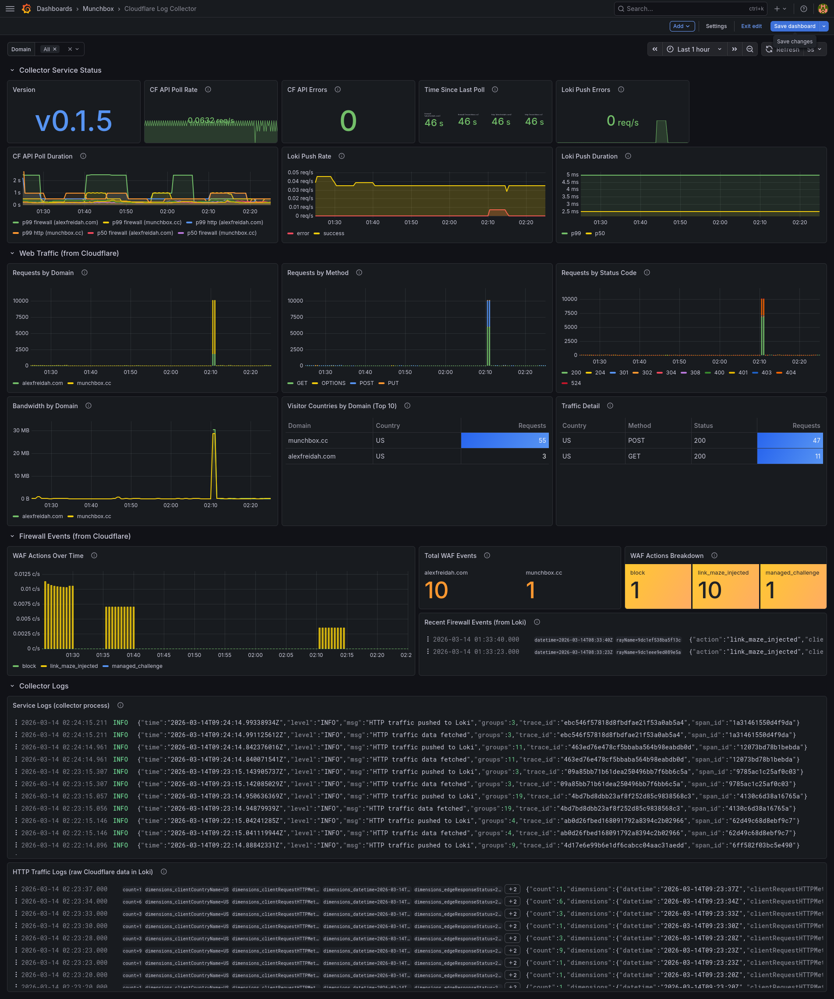

<p align="center">
  
</p>

# Cloudflare Log Collector

[](https://github.com/buckhamduffy/cloudflare-log-collector/actions/workflows/ci.yml)
[](https://opensource.org/licenses/MIT)

> **Note:** This is a fork of the [original cloudflare-log-collector](https://github.com/afreidah/cloudflare-log-collector) with added support for **account audit logs** collection.



A lightweight Go service that polls the Cloudflare GraphQL Analytics API for firewall events and HTTP traffic statistics, ships them into a self-hosted observability stack, and traces every poll cycle with OpenTelemetry.

- **Firewall events** are pushed to Loki as structured JSON log lines for querying in Grafana
- **HTTP traffic stats** are exposed as Prometheus gauges (by method, status, and country) and also pushed to Loki for raw detail
- **Every poll cycle** gets its own OpenTelemetry trace with child spans for API calls and Loki pushes, exported to Tempo via OTLP gRPC
- **Log-trace correlation** is automatic — `trace_id` and `span_id` are injected into every structured log line via a custom slog handler, enabling one-click navigation between Loki logs and Tempo traces in Grafana

```
         Cloudflare GraphQL API
                   |
                   v
      +---------------------------+
      | cloudflare-log-collector  |
      +---------------------------+
         |         |          |
         v         v          v
       Loki    Prometheus   Tempo
     (events)  (metrics)   (traces)
         \         |          /
          '--- Grafana ------'
```

## Table of Contents

- [Datasets](#datasets)
- [Prometheus Metrics](#prometheus-metrics)
- [Loki Streams](#loki-streams)
- [Configuration](#configuration)
- [Deployment](#deployment)
- [Development](#development)
- [Project Structure](#project-structure)

## Datasets

### Firewall Events (`firewallEventsAdaptive`)

Individual WAF/firewall events with full request detail. Each event becomes a JSON log line in Loki under `{job="cloudflare", type="firewall", zone="munchbox.cc"}`.

Fields captured: `action`, `clientIP`, `clientRequestHTTPHost`, `clientRequestHTTPMethodName`, `clientRequestPath`, `clientRequestQuery`, `datetime`, `rayName`, `ruleId`, `source`, `userAgent`, `clientCountryName`.

### HTTP Traffic (`httpRequestsAdaptiveGroups`)

Aggregated HTTP traffic statistics grouped by method, status code, and country. Pushed to both Prometheus (gauges) and Loki (structured JSON under `{job="cloudflare", type="http_traffic", zone="munchbox.cc"}`).

Fields captured: `count`, `datetime`, `clientRequestHTTPMethodName`, `edgeResponseStatus`, `clientCountryName`, `edgeResponseBytes`.

### Account Audit Logs

Account-level audit logs capturing administrative actions across your Cloudflare account. Each event becomes a JSON log line in Loki under `{job="cloudflare", type="audit", account="my-account"}`.

Fields captured: `id`, `account` (id, name), `action` (description, result, time, type), `actor` (id, context, email, ip_address, token_id, token_name, type), `raw` (cf_ray_id, method, status_code, uri, user_agent), `resource` (id, product, type), `zone` (id, name).

Audit log collection is disabled by default and requires explicit configuration with account IDs.

## Prometheus Metrics

Exposed on the configured metrics listen address (default `:9101`).

| Metric | Type | Labels | Description |
|--------|------|--------|-------------|
| `cflog_poll_total` | counter | `dataset`, `zone`, `status` | Poll attempts by dataset, zone, and outcome |
| `cflog_poll_duration_seconds` | histogram | `dataset`, `zone` | Poll latency |
| `cflog_last_poll_timestamp` | gauge | `dataset`, `zone` | Unix timestamp of last successful poll |
| `cflog_firewall_events_total` | counter | `action`, `zone` | Firewall events by action type |
| `cflog_audit_events_total` | counter | `action`, `account` | Audit log events by action type |
| `cflog_http_requests` | gauge | `method`, `status`, `country`, `zone` | HTTP request counts from last poll window |
| `cflog_http_bytes` | gauge | `type`, `zone` | Edge response bytes from last poll window |
| `cflog_loki_push_total` | counter | `status` | Loki push attempts by outcome |
| `cflog_loki_push_duration_seconds` | histogram | | Loki push latency |
| `cflog_build_info` | gauge | `version`, `go_version` | Build metadata |

## Loki Streams

Three log streams are pushed to Loki:

| Stream | Labels | Content |
|--------|--------|---------|
| Firewall events | `{job="cloudflare", type="firewall", zone="munchbox.cc"}` | One JSON log line per firewall event |
| HTTP traffic | `{job="cloudflare", type="http_traffic", zone="munchbox.cc"}` | One JSON log line per traffic group |
| Audit logs | `{job="cloudflare", type="audit", account="my-account"}` | One JSON log line per audit event |

Both streams include `X-Scope-OrgID` header for multi-tenant Loki deployments (configurable via `tenant_id`).

## Configuration

Configuration is loaded from a YAML file. Environment variables are expanded with `${VAR_NAME}` syntax.

```yaml
cloudflare:
  api_token: "${CF_API_TOKEN}"        # Cloudflare API token (Analytics Read)
  zones:                              # One or more zones to monitor
    - id: "${CF_ZONE_ID}"
      name: "example.com"
  audit_logs:                         # Account audit log collection (optional)
    enabled: false                    # Disabled by default
    accounts:
      - id: "${CF_ACCOUNT_ID}"
        name: "my-account"
  poll_interval: 5m                   # How often to poll (default: 5m)
  backfill_window: 1h                 # On startup, fetch this far back (default: 1h)

loki:
  endpoint: "http://loki:3100"        # Loki push API base URL
  tenant_id: "fake"                   # X-Scope-OrgID header (default: fake)
  batch_size: 100                     # Max entries per push request (default: 100)

metrics:
  listen: ":9101"                     # Prometheus /metrics endpoint (default: :9101)

tracing:
  enabled: true                       # Enable OTLP tracing (default: false)
  endpoint: "tempo:4317"              # OTLP gRPC endpoint
  sample_rate: 1.0                    # Sampling rate 0.0-1.0 (default: 1.0)
  insecure: true                      # Disable TLS for OTLP (default: false)

logging:
  level: "info"                       # Log level: debug, info, warn, error
  format: "json"                      # Log format: json, text (default: json)
```

### Cloudflare API Token

The API token requires the following permissions:

- **Account Analytics** — Read (for zone analytics)
- **Zone Analytics** — Read (for zone analytics)
- **Account Settings** — Read (required for audit logs)

Create one at [Cloudflare Dashboard > API Tokens](https://dash.cloudflare.com/profile/api-tokens).

## Deployment

### Docker

```bash
make push VERSION=v0.1.1
```

Builds and pushes multi-arch images (`linux/amd64`, `linux/arm64`) to the configured registry.

## Development

```bash
# --- Build ---
make build                  # local platform binary
make docker                 # Docker image for local arch
make push                   # build and push multi-arch images to registry

# --- Run locally ---
make run                    # requires config.yaml in project root

# --- Test & Lint ---
make test                   # unit tests with race detector and coverage
make vet                    # Go vet static analysis
make lint                   # golangci-lint
make govulncheck            # Go vulnerability scanner

# --- Release ---
make changelog              # generate CHANGELOG.md from git history (git-cliff)
make release                # tag and push to trigger GitHub Release
make release-local          # dry-run GoReleaser locally (no publish)
make deb                    # build .deb packages via GoReleaser snapshot
make publish-deb            # publish .deb packages to Aptly repository

# --- Website ---
make web-serve              # serve project website locally with live reload
make web-build              # build static site (minified)
make web-docker             # build website Docker image for local arch
make web-push               # build and push multi-arch website image

# --- Cleanup ---
make clean                  # remove build artifacts
```

## Project Structure

```
├── .goreleaser.yaml                  # GoReleaser release configuration
├── .version                          # Semantic version tag
├── cliff.toml                        # git-cliff changelog generation config
├── Dockerfile                        # Multi-stage Alpine build
├── Makefile                          # Build, test, push targets
├── cmd/
│   └── cloudflare-log-collector/
│       └── main.go                   # Entry point, config, signal handling
├── internal/
│   ├── cloudflare/
│   │   ├── client.go                 # GraphQL API client, query builders
│   │   └── client_test.go
│   ├── collector/
│   │   ├── audit.go                  # Audit log poller, Loki shipper
│   │   ├── audit_test.go
│   │   ├── firewall.go               # Firewall event poller, Loki shipper
│   │   ├── firewall_test.go
│   │   ├── http.go                   # HTTP traffic poller, metrics + Loki
│   │   └── http_test.go
│   ├── config/
│   │   ├── config.go                 # YAML config with env var expansion
│   │   └── config_test.go
│   ├── lifecycle/
│   │   ├── manager.go                # Background service lifecycle
│   │   └── manager_test.go
│   ├── loki/
│   │   ├── client.go                 # Loki push API client
│   │   └── client_test.go
│   ├── metrics/
│   │   └── metrics.go                # Prometheus metric definitions
│   └── telemetry/
│       ├── tracing.go                # OTel tracer init, span helpers
│       ├── tracehandler.go           # slog handler for trace correlation
│       └── tracehandler_test.go
├── web/
│   ├── hugo.toml                     # Hugo site configuration
│   ├── Dockerfile                    # Multi-stage Hugo + nginx build
│   ├── content/                      # Site content (Markdown)
│   ├── layouts/                      # Custom templates and shortcodes
│   ├── assets/css/                   # Custom theme variant
│   └── themes/hugo-theme-relearn/    # Documentation theme (submodule)
├── packaging/
│   ├── cloudflare-log-collector.service  # Systemd unit file
│   ├── config.example.yaml           # Example configuration
│   ├── postinst, prerm, postrm       # Debian package scripts
│   ├── copyright                     # License for Debian packaging
│   └── changelog                     # Release notes for Debian packaging
└── docs/
    ├── images/
    │   └── grafana.png               # Grafana dashboard screenshot
    └── style-guide.md                # Code style conventions
```

## Rate Limits and Retry

The Cloudflare GraphQL Analytics API allows 300 queries per 5 minutes. With two queries per poll cycle (firewall + HTTP) per zone at the default 5-minute interval, usage stays well within limits. Free plan adaptive datasets support approximately 24 hours of lookback; the default backfill window is capped at 1 hour.

Both the Cloudflare and Loki clients automatically retry on transient failures (HTTP 429, 502, 503, 504) with exponential backoff up to 3 retries. The `Retry-After` header is honored when present. If a query returns the maximum number of results (10,000 firewall events or 5,000 HTTP groups), a warning is logged indicating potential truncation.

## License

MIT
